<div align="center">

# fluidmech

**Engineering fluid mechanics in Python — from pipe friction and pumps to CFD, cavitation and
water hammer, with animations, publication-quality figures and an interactive web app.**

[](https://github.com/ktwyw/fluidmech/actions/workflows/tests.yml)
[](https://www.python.org/)
[](pyproject.toml)
[](docs/VALIDATION.md)
[](LICENSE)

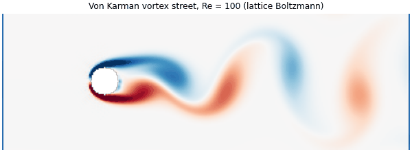

<sub>A von Kármán vortex street behind a cylinder at Re = 100, computed with the lattice-Boltzmann solver in <code>fluidmech.cfd</code>.</sub>

</div>

`fluidmech` is a small, readable, **dependency-free** library for the calculations that civil,
mechanical, chemical and environmental engineers do every day. Every function is documented with
its equation and units, tested, and [validated against published reference data](docs/VALIDATION.md).
It comes with **50 worked examples**, **4 Jupyter tutorials**, a **command-line calculator**, a complete set of
**[weekly teaching materials](course/)** (186 scripts: 15 lecture examples for every teaching week) for a second-year
chemical-engineering fluid mechanics course, and a **[showcase](showcase/)** of advanced topics, animations,
publication figures and interactive apps.

> **Try it in 60 seconds:** `pip install -e ".[apps]"` then `streamlit run showcase/apps/fluidmech_studio.py`
> opens FluidMech Studio in your browser - six live calculators with charts.

## Why fluidmech?

- **Zero core dependencies.** The calculation library is pure Python; NumPy, SciPy and matplotlib are only
  needed for the optional CFD solvers, figures, animations and apps.
- **Engineer-friendly.** SI units throughout, clear function names, results as dataclasses, and a
  `units` module for gpm, psi, ft and friends.
- **Trustworthy.** 440+ tests, doctests, and a validation report against NIST, IAPWS, NACA 1135 and exact solutions.
- **Educational.** Short, commented source you can read alongside your textbook, plus a
  [theory reference](docs/THEORY.md) listing every equation used.
- **Beyond the textbook.** A Newton-Raphson pipe-network solver (the EPANET algorithm) with pumps
  and multiple reservoirs, gradually-varied-flow profiles, choked nozzles, method-of-characteristics water
  hammer, Rayleigh-Plesset cavitation, and compact CFD solvers (lid-driven cavity, lattice Boltzmann).
- **Beautiful output.** A `viz` module for journal-ready figures, GIF animations and a browser app.

## Installation

```bash
pip install git+https://github.com/ktwyw/fluidmech.git
```

or, for development:

```bash
git clone https://github.com/ktwyw/fluidmech.git
cd fluidmech
pip install -e ".[dev,examples]"
```

## Quick start

**Pipe head loss** — the three classic pipe problems:

```python
from fluidmech import Fluid
from fluidmech import pipe_flow as pf

water = Fluid.water(20)  # 20 °C
r = pf.head_loss(
    flow_rate=0.02, diameter=0.1, length=200, fluid=water, roughness=pf.ROUGHNESS["commercial_steel"], k_total=2.85
)
print(r.regime, r.friction_factor, r.total_head_loss)  # turbulent 0.0182 12.95 m

pf.flow_rate_for_head_loss(8.0, 0.1, 200, water, 0.045e-3)  # Q for a given head loss
pf.diameter_for_head_loss(0.02, 5.0, 200, water, 0.045e-3)  # D for a given head loss
```

**Pipe network with a pump and two reservoirs:**

```python
from fluidmech import Network, PumpCurve

net = Network()
net.add_reservoir("Sump", head=0.0)
net.add_reservoir("Tank", head=15.0)
net.add_junction("J1", elevation=0.0, demand=0.010)
net.add_pump("Pump", "Sump", "J1", PumpCurve.from_points([0, 0.05, 0.1], [40, 36, 25]))
net.add_pipe("Main", "J1", "Tank", length=400, diameter=0.2, roughness=0.26e-3, k_minor=5)
print(net.solve().summary())
```

**Pump operating point, affinity laws and NPSH:**

```python
from fluidmech import pumps

pump = PumpCurve.from_points([0, 0.04, 0.08, 0.12], [42, 40, 33.5, 22.5], [0, 0.62, 0.80, 0.68])
system = pumps.system_curve(static_head=12, diameter=0.25, length=800, fluid=water, roughness=0.26e-3)
op = pumps.operating_point(pump, system)  # flow, head, efficiency, power
slower = pump.scaled(speed_ratio=0.8)  # variable-speed drive
pumps.npsh_available(suction_static_head=-3.0, suction_head_loss=0.4, fluid_temperature=40)
```

**Open channels:**

```python
from fluidmech.open_channel import TrapezoidalChannel, gvf_profile, classify_profile

canal = TrapezoidalChannel(bottom_width=4.0, side_slope=1.5)
yn = canal.normal_depth(flow_rate=25, manning_n=0.012, slope=0.0008)  # 1.60 m
yc = canal.critical_depth(flow_rate=25)  # 1.33 m
classify_profile(canal, 25, 0.012, 0.0008, depth=2.8)  # 'M1'
profile = gvf_profile(canal, 25, 0.012, 0.0008, start_depth=2.8, end_depth=1.62)
```

**Compressible flow:**

```python
from fluidmech import compressible as c

c.area_ratio(2.0)  # A/A* = 1.6875
c.normal_shock(2.0).mach2  # 0.5774
c.choked_mass_flow(1e-4, 500e3, 20)  # kg/s through a 1 cm² throat
```

**Unit conversion:**

```python
from fluidmech.units import convert

convert(450, "gpm", "L/s")  # 28.39
convert(60, "psi", "mH2O")  # 42.18
```

## Command-line calculator

```console
$ fluidmech pipe -Q 0.02 -D 0.1 -L 200 -e commercial_steel -K 2.85
Pipe D = 100.0 mm, L = 200.0 m, eps = 0.0450 mm, sum K = 2.85
  flow rate        20.000 L/s
  velocity         2.546 m/s
  Reynolds number  2.538e+05 (turbulent)
  friction factor  0.01816
  total head loss  12.953 m  (126.80 kPa)

$ fluidmech pipe -Q 0.02 --head-loss 5 -L 200 -e 0.045      # size a pipe
$ fluidmech channel -Q 25 -b 4 -z 1.5 -n 0.012 -S 0.0008    # normal & critical depth
$ fluidmech props --fluid water -T 60                       # properties
$ fluidmech convert 100 gpm L/s                             # units
```

## Showcase: see fluid mechanics move

| | |
|:-:|:-:|
| 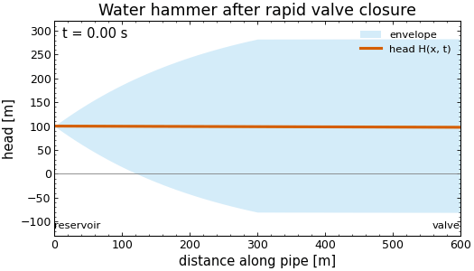<br>Water-hammer wave (method of characteristics) | 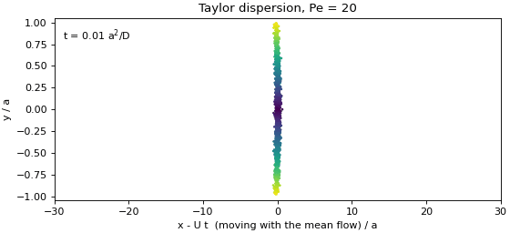<br>Taylor dispersion of a tracer pulse |
| 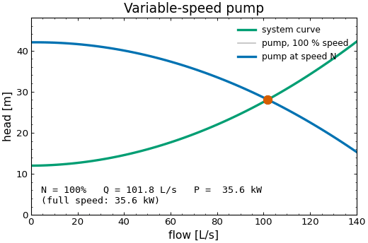<br>Variable-speed pump on its system curve | 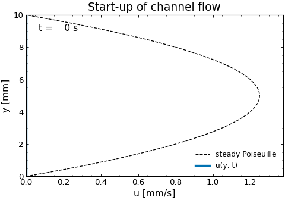<br>Start-up of channel flow |
| 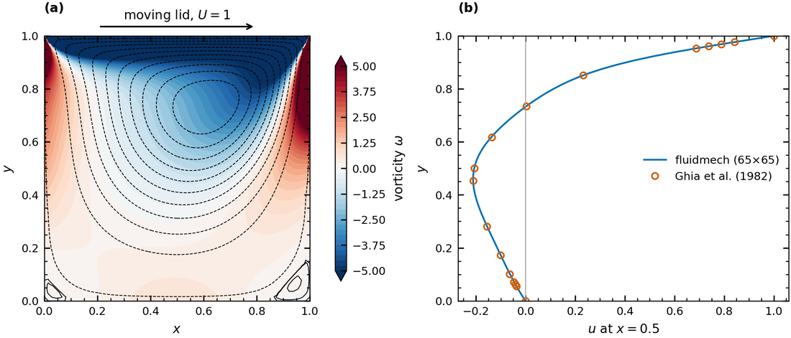<br>Lid-driven cavity CFD vs. Ghia et al. (1982) | 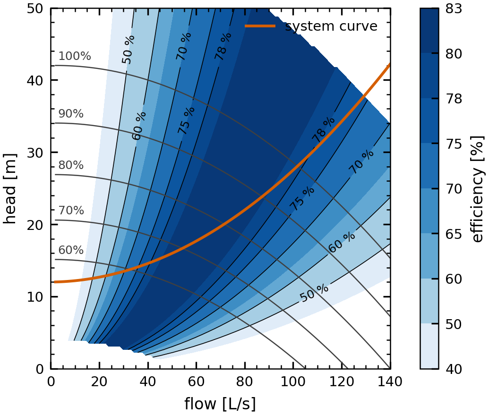<br>Pump efficiency 'hill chart' |

The [showcase](showcase/) contains six **advanced topics** (CFD, lattice Boltzmann, Blasius boundary
layer, water hammer, cavitation, Taylor dispersion), the scripts that make these **animations**, four
**publication-quality figures**, the **FluidMech Studio** web app and two desktop slider explorers.

```python
from fluidmech import viz  # journal-ready figures in three lines

with viz.style("paper"):
    fig, ax = viz.figure(width="single")
    viz.moody_chart(ax)
    viz.savefig(fig, "moody", ("pdf", "png", "svg"))
```

## Gallery

| | |
|:-:|:-:|
| 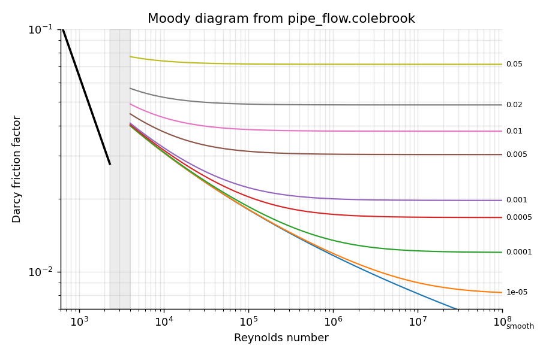<br>Moody diagram from the Colebrook equation | 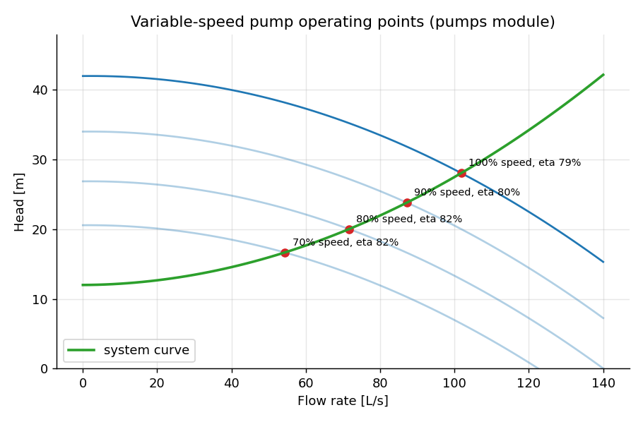<br>Variable-speed pump operating points |
| 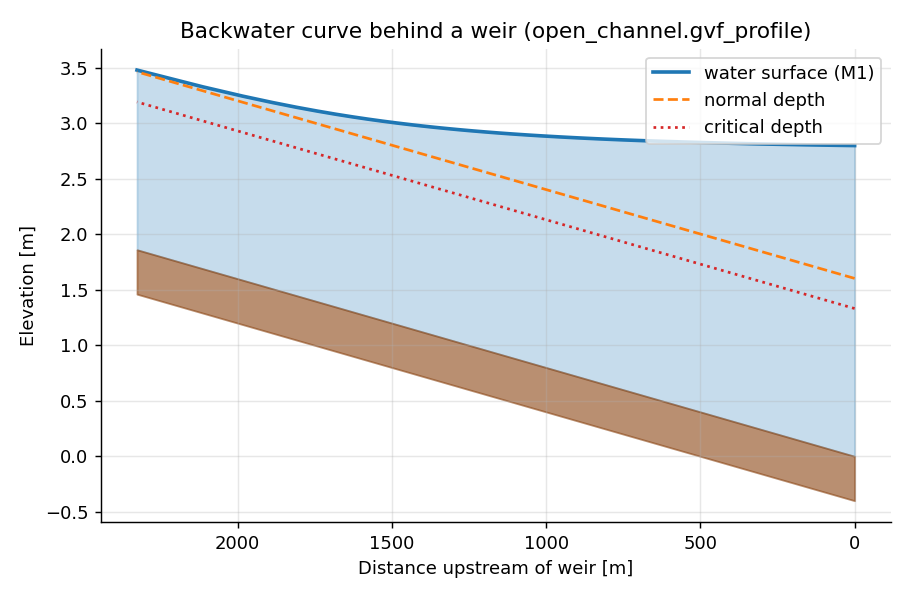<br>Backwater (M1) profile behind a weir | 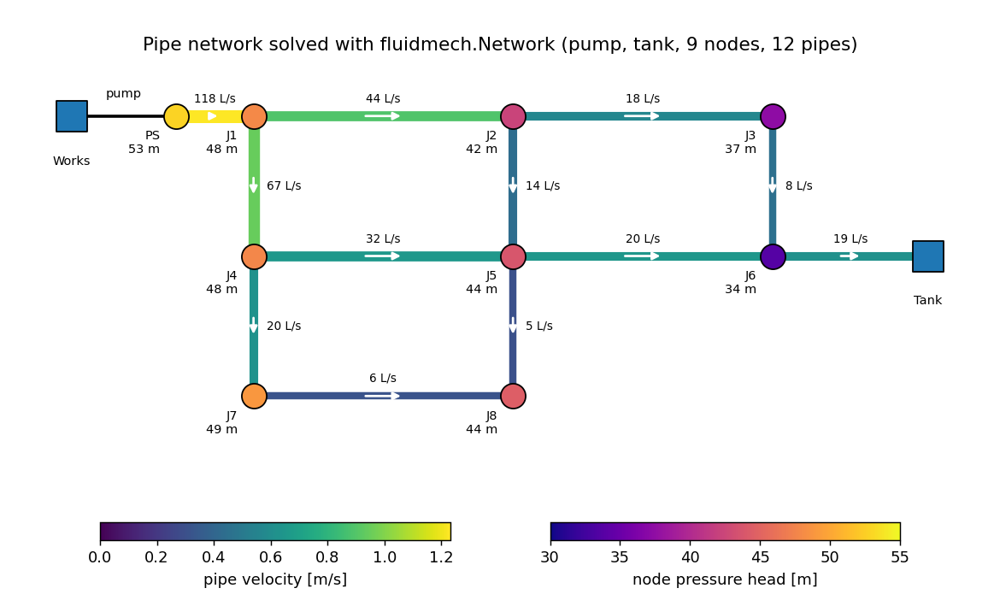<br>Looped network with pump and storage tank |

## What's inside

| Module | Capabilities |
|---|---|
| `properties` | Water (density, viscosity, vapour pressure, surface tension) and air properties; the `Fluid` class |
| `dimensionless` | Reynolds, Froude, Mach, Weber and Euler numbers; flow-regime classification |
| `hydrostatics` | Pressure at depth, manometers, forces on plane and curved surfaces, buoyancy, rigid-body acceleration and rotation |
| `bernoulli` | Total head, Pitot tube, Venturi and orifice meters, tank draining |
| `pipe_flow` | Colebrook, Swamee–Jain and Haaland friction factors; minor losses; Type 1, 2 and 3 problems |
| `networks` | Steady-state network solver: reservoirs, junctions, pipes and pumps, any topology |
| `pumps` | Curve fitting, affinity laws, series/parallel, operating point, NPSH, specific speed |
| `open_channel` | Manning, normal and critical depth, specific energy, jumps, weirs, sluice gates, GVF profiles |
| `compressible` | Isentropic relations, normal shocks, Rayleigh–Pitot, choked and subsonic nozzle flow |
| `drag` | Drag coefficients, boundary layers, skin friction, terminal velocity of particles, drops and bubbles, hindered settling |
| `transients` | Water-hammer wave speed, Joukowsky and slow-closure surges, method-of-characteristics simulation |
| `rheology` | Newtonian, power-law, Bingham, Herschel–Bulkley and Carreau models; fitting rheometer data; Andrade temperature fits |
| `laminar` | Exact Navier–Stokes solutions: Couette–Poiseuille, Hagen–Poiseuille, annulus, falling film, power-law and Bingham pipe flow, Stokes' problems, duct f·Re, Blasius boundary layer |
| `potential_flow` | Uniform stream, source, vortex and doublet superposition; cylinder, half-body, Rankine oval, Kutta–Joukowski |
| `turbulence` | Law of the wall, friction velocity, y⁺ for CFD meshing, entrance length, Kolmogorov scales |
| `porous` | Darcy's law, Kozeny–Carman, Ergun, minimum fluidisation, cake filtration, membranes |
| `dimensional` | Automatic Buckingham Pi groups with exact rational arithmetic |
| `mixing` | Impeller power curves, blend time, micromixing, scale-up rules, RTD and ideal-reactor conversion |
| `units` | Conversion of ~80 units across 13 quantities, including temperatures |
| `solvers` | Bisection, bracketing root finder, linear solver, polynomial fitting |
| `cavitation` | Rayleigh–Plesset bubble dynamics and Rayleigh's collapse time |
| `cfd` *(optional: numpy, scipy)* | Lid-driven cavity (stream function–vorticity), lattice-Boltzmann cylinder wake, Taylor-dispersion Monte Carlo |
| `viz` *(optional: matplotlib)* | Publication styles (paper/slides/poster), colour-blind-safe palette, Moody/pump/drag charts, multi-format export |

## Repository layout

| Folder | Contents |
|---|---|
| [`src/fluidmech/`](src/fluidmech) | The library (26 modules; the core modules need no dependencies) |
| [`examples/`](examples) | 50 worked engineering examples |
| [`course/`](course) | CHME 202 weekly teaching scripts, labs and review problems (186) |
| [`showcase/`](showcase) | Advanced topics, GIF animations, publication figures and interactive apps |
| [`notebooks/`](notebooks) | Four executed Jupyter tutorials |
| [`docs/`](docs) | Theory reference, validation report, gallery images |
| [`tests/`](tests) | 440+ tests, run on Linux, Windows and macOS for every push |

## Teaching materials: CHME 202 Fluid Mechanics

The [`course/`](course/) folder follows the weekly plan of a 2nd-year chemical-engineering fluid mechanics
course (CHME 202) with **186 short, runnable scripts** — 15 lecture examples for
every teaching week, Python versions of the three lab assignments, midterm and final review problems with
computed solutions, and a pump-selection bridge project aligned with industry practice.

| Weeks | Topics |
|:-:|---|
| 1–3 | Fluid properties and non-Newtonian rheology · statics and rigid-body motion · Bernoulli (Lab 1: Venturi calibration) |
| 4–6 | Euler equations and potential flow · Navier–Stokes (SymPy and finite differences) · exact viscous solutions |
| 9–10 | Turbulence, head losses, y⁺ for CFD (Lab 2: duct flow by finite differences) · pipe systems and pumps |
| 11–12 | Immersed bodies, drops and bubbles (Lab 3: settling experiment) · packed beds, fluidisation, filtration, membranes |
| 13–15 | Dimensional analysis (automatic Buckingham Pi) · mixing and reactions · integrated design problem |

```bash
pip install -e ".[course]"
python course/week10_pipe_systems_pumps/w10_08_grundfos_bridge_project.py
python course/run_all.py      # run all 186 course scripts
```

## Examples and tutorials

**[50 worked examples](examples/README.md)** covering the whole subject — each a short,
runnable script that prints its results and explains them. A selection:

| Topic | Examples |
|---|---|
| Pipes & networks | Hardy Cross vs. Newton network solvers · town water network · fire-flow and pipe-break scenarios · three-reservoir problem · economic pipe diameter · pipe sizing chart · Monte Carlo uncertainty |
| Pumps | operating point · variable-speed energy savings · series vs. parallel · NPSH and cavitation · tank filling simulation |
| Transients | water hammer by pipe material · valve closure time selection |
| Open channels | rating curves · specific energy and choking · hydraulic jumps · jump location below a sluice gate · backwater curves · weirs |
| Compressible | de Laval nozzle design · pressure-vessel blowdown · supersonic Pitot tube |
| External flow | settling velocity · wind loads · ship hull friction |
| Practice | US customary units · fire hydrant flow test · drip irrigation laterals |

**[Jupyter tutorials](notebooks/)** (render directly on GitHub):
[Getting started](notebooks/01_getting_started.ipynb) ·
[Pumps and networks](notebooks/02_pipe_networks_and_pumps.ipynb) ·
[Open-channel hydraulics](notebooks/03_open_channel_hydraulics.ipynb) ·
[Compressible flow](notebooks/04_compressible_flow.ipynb)

```bash
python examples/36_water_distribution_network.py   # run one example
python examples/run_all.py                         # run all 50
```

## Validation

Results are checked against NIST and IAPWS water properties, the International Standard
Atmosphere, NACA 1135 compressible-flow tables, the standard sphere drag curve and exact
analytical solutions (Hagen–Poiseuille, Bélanger, critical depth, von Kármán rough-pipe law).
See the full **[validation report](docs/VALIDATION.md)**; regenerate it with `python docs/validate.py`.

## Scope and limitations

`fluidmech` targets steady, one-dimensional engineering calculations. It is not a CFD code, and
the network solver does not (yet) model control valves, check valves or extended-period
simulation. Correlations are valid within their stated ranges. As with any engineering
software, verify important results independently before using them in design.

## Roadmap

- [ ] Notebook versions of the weekly course scripts
- [ ] More FluidMech Studio pages (packed beds, stirred tanks, compressible nozzles)
- [ ] Hazen–Williams option for networks, check valves and pressure-reducing valves
- [ ] Extended-period simulation (tank levels over time)
- [ ] Fanno and Rayleigh flow
- [ ] Optional NumPy vectorisation for parameter sweeps

Ideas and pull requests are welcome — see [CONTRIBUTING.md](CONTRIBUTING.md).

## Author

**Yanwei Wang** [](https://orcid.org/0000-0002-8488-9833)

This is a personal project, developed to support teaching a second-year fluid mechanics course
(CHME 202) at Nazarbayev University. Interests: multiscale modelling, complex fluids and rheology, and transport phenomena.

[GitHub](https://github.com/ktwyw) ·
[ORCID](https://orcid.org/0000-0002-8488-9833) ·
[Google Scholar](https://scholar.google.com/citations?user=PAAv_KMAAAAJ&hl=en) ·
[ResearchGate](https://www.researchgate.net/profile/Yanwei-Wang-19) ·
[LinkedIn](https://www.linkedin.com/in/yanwei-wang-1228b12/) ·
wangyanwei@gmail.com

Questions, corrections and suggestions are welcome as
[GitHub issues](https://github.com/ktwyw/fluidmech/issues).

## Citing

If you use `fluidmech` in teaching or research, please cite it using the metadata in
[`CITATION.cff`](CITATION.cff) (GitHub shows a "Cite this repository" button).

## License

[MIT](LICENSE)
